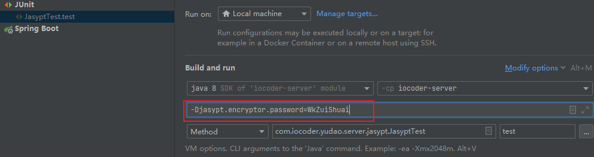

# iocoder-pro

#### 介绍
使用SpringBoot，Spring Security，JWT实现的后端开发脚手架
参考ruoyi-vue、ruoyi-vue-pro搭建

#### 软件架构

| 项目                     | 说明              |
|------------------------|-----------------|
| `iocoder-dependencies` | Maven 依赖版本管理    |
| `iocoder-framework`    | Java 框架拓展       |
| `iocoder-server`       | 启动系统服务          |
| `iocoder-system`       | 系统功能的 Module 模块 |
| `iocoder-api`          | 系统接口模块          |
| `iocoder-commons`      | 公共模块            |
| `iocoder-activiti`     | activiti工作流     |
| `iocoder-file`         | 附件文件            |
| `iocoder-webOffce`     | 在线编辑            |

#### 使用说明

1、克隆代码
    使用 [IDEA](https://www.jetbrains.com/idea/) 克隆 [https://gitee.com/wztongkai/iocoder-pro.git ](https://gitee.com/wztongkai/iocoder-pro.git) 仓库的最新代码

2、初始化MySQL
    创建名为 ``iocoder-pro`` 数据库，并执行 ``sql`` 目录下的 ``iocoder-pro.sql`` 文件

3、 为启动类 ``IoCoderApplication.java``,``JasyptTest``设置启动参数 : ``-Djasypt.encryptor.password=WkZuiShuai``
    
    执行 ``iocoder-server`` 模块 ``test`` 下的 ``JasyptTest`` 文件 中的 test()方法，生成明文的加密字符串

4、修改 ``application-dev.yml`` 配置文件中明文密码和用户名 (使用第三步生成的加密字符串替换  ENC() 中的字符串)

5、运行 ``iocoder-server`` 模块中启动类 ``IoCoderApplication.java`` 启动服务 

### 部署
1、执行maven中Lifecycle下的 clean、install/package 将项目打包
2、将 ``iocoder-server``模块下 target中的 iocoder-server.jar 部署在服务器中
3、执行 
    java -jar iocoder-server.jar --jasypt.encryptor.password=WkZuiShuai 或
    java -Djasypt.encryptor.password=WkZuiShuai -jar iocoder-server.jar 启动项目

附加：
流程图绘制地址：https://miyuesc.github.io/vite-vue-bpmn-process/
